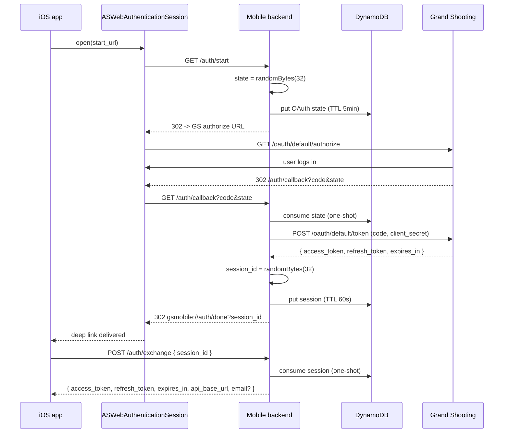
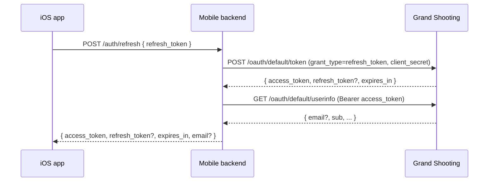

# Auth flow

The Grand Shooting API speaks OAuth2 Authorization Code, **and requires a
`client_secret`**. Because we can't ship the secret in the iOS app, this
backend acts as a confidential client. The iOS app starts the dance, the
backend completes it, and the backend hands tokens back to the app via a
one-shot session id.

## Sequence

After the token exchange the backend also calls `GET /oauth/default/userinfo`
(the standard OIDC endpoint) with the freshly minted access token to retrieve
the user's email. The email is persisted alongside the tokens in the
short-lived session record and surfaced in the `/auth/exchange` response.
The lookup is best-effort: if it fails (404, network error, malformed body)
the sign-in still completes — `email` is simply omitted. The iOS client
treats it as optional and falls back to "non-staff" gating in that case.

## Refresh

The userinfo round-trip on every refresh keeps `email` available for cold
launches where only a refresh token is stored in the Keychain. As with the
exchange flow, a userinfo failure does not abort the refresh.

## Security notes

- `state` is 32 random bytes (256 bits), hex-encoded.
- `session_id` is 32 random bytes — it lives for at most 60 seconds and is
  consumed on first read. Replays return 401.
- The backend never returns tokens via a URL query string; only via the
  `POST /auth/exchange` response body, over TLS.
- `client_secret` is fetched from Secrets Manager on cold start and cached in
  memory. It never appears in CloudWatch logs (we redact via structured
  logging — TODO: verify with a log filter test in staging).

## Open TODOs

- Derive the per-tenant API shard URL (`api-34.grand-shooting.com`) from the
  access token claims or a `GET /me` call instead of hardcoding to the OAuth
  base URL.
- Consider PKCE on top of state, even though our backend already holds the
  client_secret — it's belt-and-braces protection against backend
  compromise.
